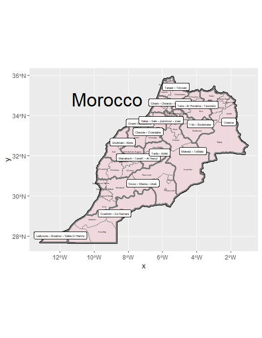
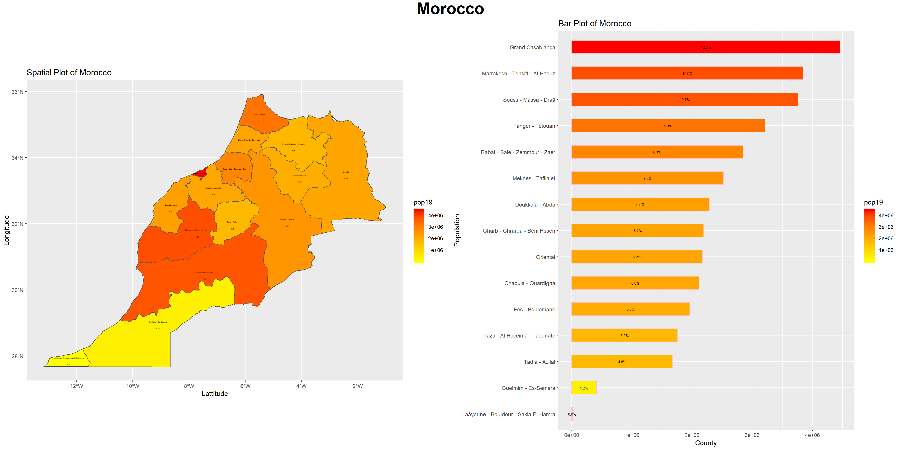
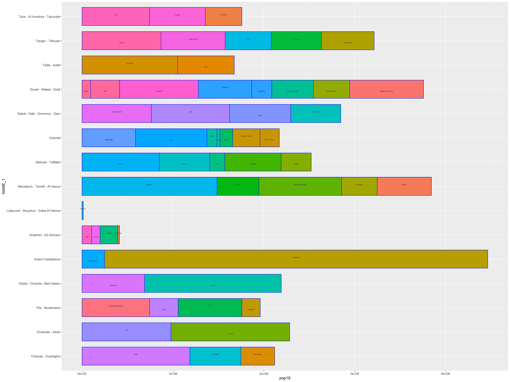

# Morocco
An Analysis of Morocco's Borders, Populations, and Services

### Administrative Subdivisions of Morocco
Administrative 1 and 2 Subdivisions

Below are the first and second political subdivisions of Morocco. Morocco is a country located on the North-Western coast of Africa. Its captiol is Casablanca with the greater region of its capitol being Grand Casablanca. Poltically, it has experienced some tumultuous periods with 2011 to 2015 being a major one which led to the redistribution of political borders. 

For the majority of this page, the second administrative subdivision of Tata, which is in the lower central region of Morocco, as well as the third administrative subdivision of Amerzgane which is in the Ouarzazate region of Morocco. It is directly to the North of the subdivision of Tata.
__________________________________________________

### Population Density of Morocco
Administrative 1 and 2 Subdivisions by Population Density

___________________________________________________

