# Morocco
An Analysis of Morocco's Borders, Populations, and Services

## Administrative Subdivisions of Morocco
### Administrative 1 and 2 Subdivisions
Below are the first and second political subdivisions of Morocco. Morocco is a country located on the North-Western coast of Africa. Its captiol is Rabat which is the seventh capitol city to govern Morocco; however its unofficial cultural, economic, and social capitol is in Casablanca which also happens to be the largest urban settlement in all of Morocco. Poltically, it has experienced some tumultuous periods with 2011 to 2015 being a major one which led to the redistribution of political borders. 
For more reading on Moroccan political history: https://www.bbc.com/news/world-africa-14123260 

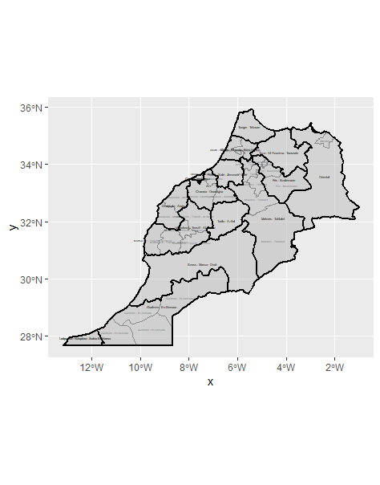

For the majority of this page, the second administrative subdivision of Tata, which is in the lower central region of Morocco, as well as the third administrative subdivision of Amerzgane which is in the Ouarzazate region of Morocco. It is directly to the North of the subdivision of Tata.

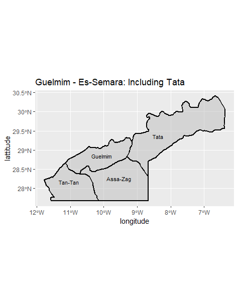
__________________________________________________

## Population in Morocco
### Administrative 1 and 2 Subdivisions by Population Predictors
Below are the same political subdivisions of Morocco with the population density separated out by each administrative subdivision. The total population of Morocco is around 35 million with a great portion of that population distributed to the North Western coastline. Part of the reason this is true is because the coast, throughout Moroccan history, has played an important role economically in terms of trading as well as culutrally in terms of culutral diffusion through the causeways of Europe and the Mediterranean. 

This plot includes the ranking of second administrative levels by population in the bar plot on the right as well as a corresponding color map of the same second administrative levels geographically placed in Morocco. It is clear that the majority of the population resides in the North Western corridor in the city of Casablanca with the number 1 ranking administrative subdivision in terms of population, but also in the center of Morocco. The regions of Sous-Massa-Draa as well as Marrakech-Tenesifit-Al Haouz also have a lot of people living in them-with 10.9% and 10.7% of the population respectively With the administrative subdivision of Tata and Ourzazate specifically, those are relatively low ranking 

This plot does the same as the bar plot above, but with the third administratifve subdivisions which are not plotted on the map of Morocco. It breaks down each administrative 2 subdivisions by population into the administrative 3 subdivisions. The reason why Amerzgane is not visible on this bar plot is that at this point in the project I was using HDX data which is updated more frequently than GADM data, but is not as complete or consistant. This proved to be an issue for me later in the project, so after this I switched to GADM data which was older, but more consistant and easier to work with. Because of Morocco's politically tumultuous past, the borders of these administrative subdivisions do not always line up which is why Amerzgane does not appear for analysis on this graph. 

## Validation of Population Prediction
In order to validate that the predictive model of population was accurate I compared the difference, means, and logarithmic means of each administrative subdivision to the actual population raster to detemrine which model was the most accurate in the country as a whole, and with the most populous subdivision of Casablanca as an example. 

### The correlation of population and all dependent variables
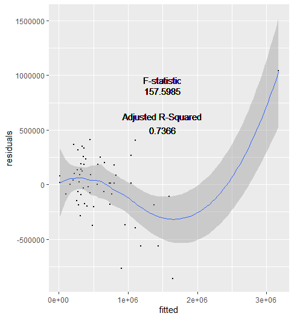
### The correlation of water and population in Morocco

I chose not to include the 3D rendering of the difference of all of the following because the differences turned out to be minimal and Morocco has such a large land area that they all looked the same. There were minute differences with that rendering, but I believed a histogram explaining whether the population was over or underestimated was more effective at bolstering analysis
### A histogram describing the predicted distributed densities of population
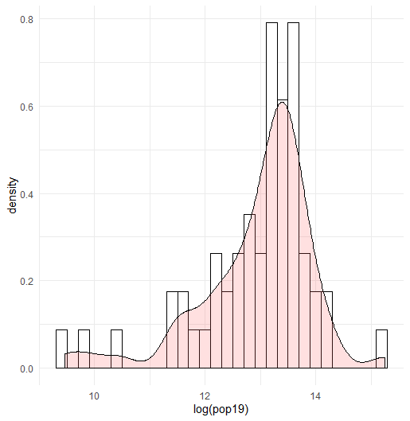
### Difference of Sums Analysis
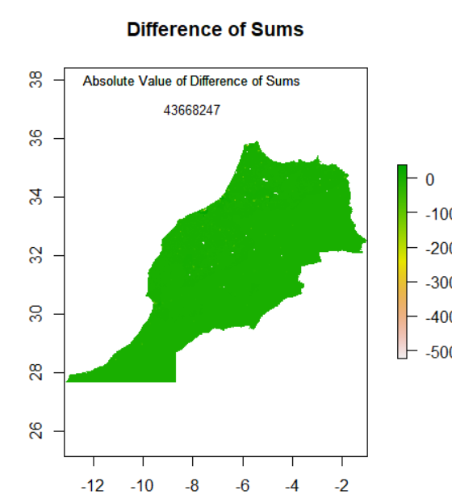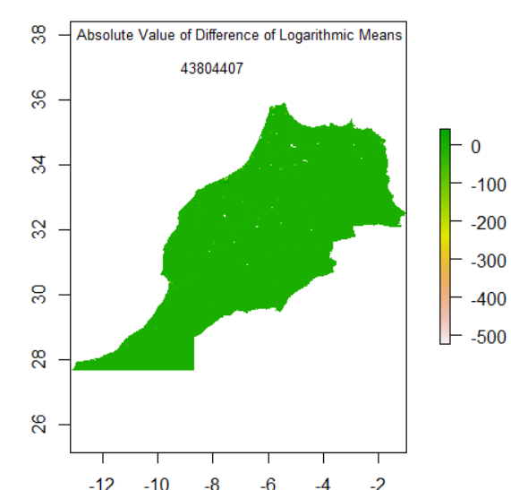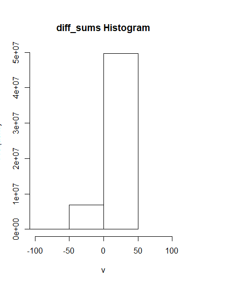
### Difference of Means Analysis
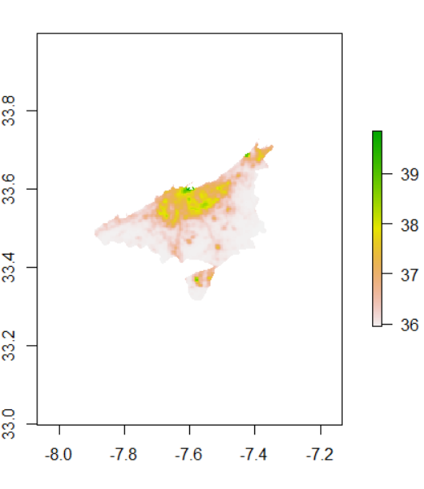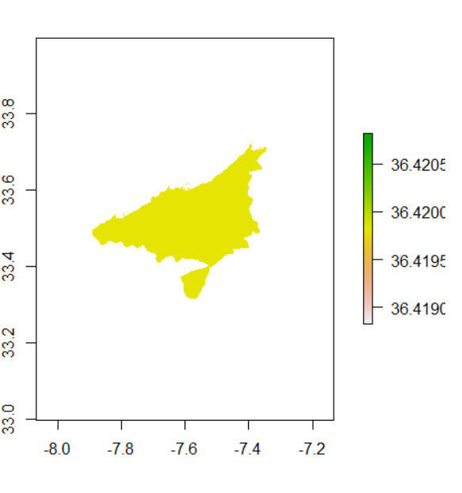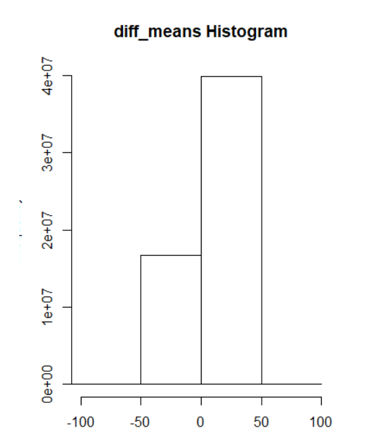
### Difference of Logarithmic Means Analysis 
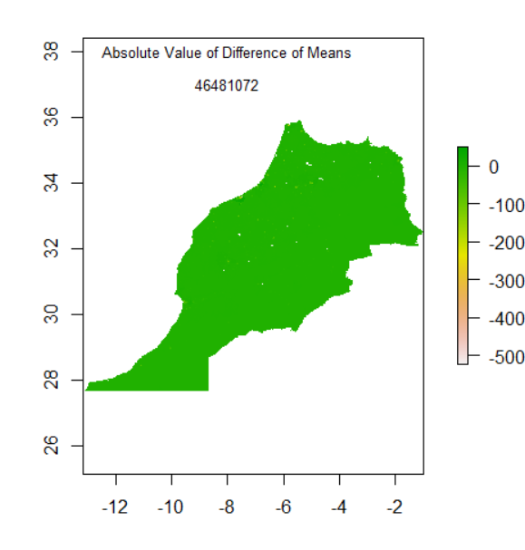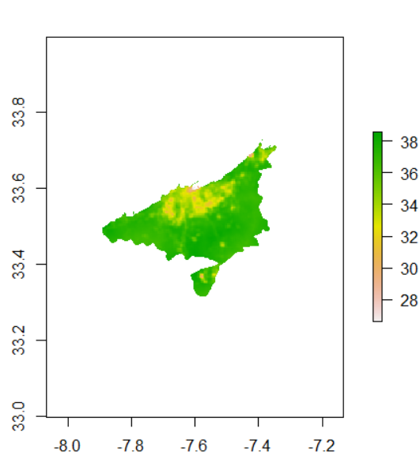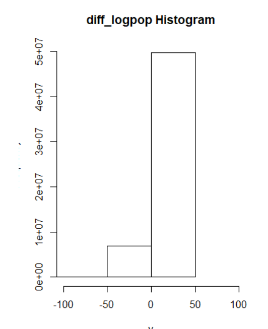
Overall, the Difference of Sums was the smallest error number therby indicating that this predictive model was the closest to the actual population and therefore the most accurate. 

Despite these approaches, the data would still be grossly over-populated or under-populated with respect to the area it is in or the model it is in. Trying to improve this to a substantially smaller margin of error would ultimately require us to ask ourselves about the ethics of doing so. If we were to increase satellite imagery to capture every person and their living habitats, is this ethical? Are we breaching basic codes of privacy? Would the government of an NGO need a warrant to take images such as these? These are all questions that as we improve machine learning, in ways such as Random Forest, and satellite imagery that we need to consider.
___________________________________________________
## Access to Healthcare and Roads as Determined by Topography

The regions of Tata and Amerzgane are relatively rural. They have a mainly desert topography as well as two mountian ranges which run through the area and essentially topographically isolate the region. These counties and subdivisions lie in the south east/south central part of pre-revolution Morocco cerca 2015. In Tata there are an estimated 108283 people, and in Amerzgane there are an estimated 116034 people. Across the two there are around 30 distinctly urbanized areas which can also be classified as human settlements.
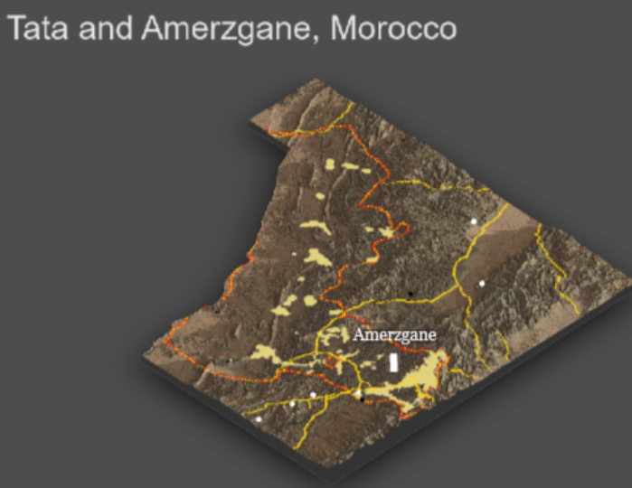

### Analysis of Urban Settlements
Tata has almost a third of the total urban areas in these two subdivisions, however it has almost double the area as Amerzgane. There is only one urbanized area within Tata that is even approaching a density of 100 people per gridcell and all of the areas are around 20000 with one exception of a 40000 person settlement. This means that Tata is a very rural and non-densely populated region which reflects the desert terrain and the lack of coastal access. Amerzgane, on the other hand, has two thirds of the urbanized areas in this region despite having only half of the area that Tata possesses. Most of these distinct urban areas are concentrated in the northeast, with the largest one of  50000 people occurring at the 31N and 7.5W parallel. Additionally, the highest density single settlement with almost 300 people per gridcell is in Amerzgane on the eastern border. This reflects that Amerzgane is more densely populated than Tata.

### Access to Roadways and Clinics
Overall, roadway access is not universal or comprehensive in these areas. There are no primary roads: only private, secondary, and tertiary. Additionally, there are only 7 hospitals and one clinic, none of which are in Tata. Tata is a large administrative boundary with much distance and poor roads to travel on. This means that people seeking healthcare in this region have to drive many miles in order to find the care that they need.
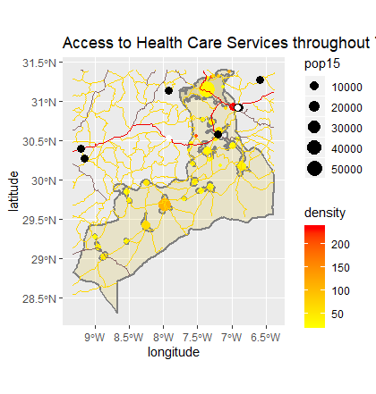

### The Problem of Inaccesibility
In addition to the density and location of the clinic, I also plotted instances of births throughout this region- of which there were 47000 total. Many of these happened in the urbanized areas and many were clearly unassisted home births. This is remarkably dangerous for all parties involved: the mother, the child, and anyone in the room who could be exposed to bloodborne pathogens. This is just one instance of the dangers of inaccessible healthcare. 
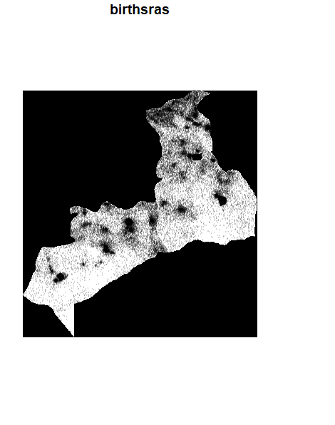

